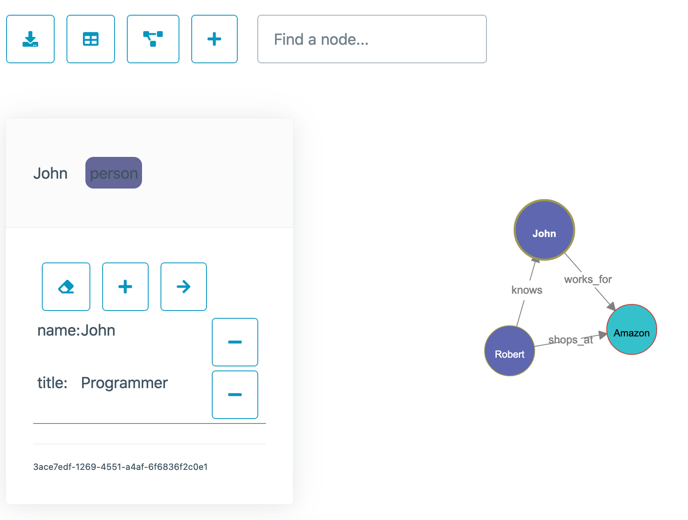

# CDK Neptune Knowledge Graph

This CDK sample application deploys a Neptune cluster and a static web site to provide
a convenient user interface for building a knowledge graph. It uses Cognito to provide 
authentication to the web site.

_Note that this is sample code, and is not meant to be used in production!_

## What can I learn from this sample?
    - How to structure a CDK application that includes multiple stacks
    - How to provision a Neptune cluster with CDK
    - How to connect to Neptune using JavaScript and Gremlin from a Lambda function
    - How to configure API Gateway to use Cognito as the authorizer
    - How to organize and deploy Lambda functions with CDK as part of a REST API
    - How to use CDK to deploy a static website using S3 and CloudFront
    - How to use webpack to reduce the size of Lambda assets
    - How to upload and download S3 files using signed URLs

## Screen shot



## Data Model

You can store any simple graph data with this general layout:

Node (vertex)
    - label (immutable after creation)
    - id (auto generated)
    - properties: A map of key value pairs

Edge
    - label (immutable after creation)
    - properties: A map of key value pairs

The "name" property is special. This is the property used on the canvas as the text in the 
middle of each node. For edges, the text is the label.

## Usage

### Searching

The search bar can be used to view a subset of the graph or to focus on a particular node. Type in the name of a node and the node will be centered in the view. Hit the Enter key and the graph will reload with only that node and it's immediate relationships. Empty out the search bar and hit Enter again to reload the entire graph. You can also double click on white space somewhere on the canvas and the graph will reload.

Labels can also be searched, for example, type `label:Person` to see just nodes with that label, and all of their direct relationships. You can also combine terms with `and`. For example, you could search for `label:Company and name:John` to see all nodes labeled as Company and also view the node named John, which can be helpful when adding edges between nodes that are scattered in far corners of your knowledge graph.

### Partitions

TODO


## Deployment

Create your own domain and certificate for the website manually before deploying.

Create `bin/config.js` based on `bin/config-sample.js` . Populate `DOMAIN`, 
`CERTIFICATE_ARN`, and `HOSTED_ZONE_ID`.

Also create `web/js/config.js` based on `web/js/config-sample.js`. You have to deploy once 
before you can complete the configuration in that file.

Deploy the CDK application. Note that Neptune will consume 2 Elastic IPs in your configured region.
Also note that these resources will cost money each month!

```sh
npm i
cd web
npm i
cd ../lambda
npm i
cd ..
touch web/js/jwt.js
npm run build
cdk deploy --profile your-profile --all
```

There is a bit of chicken-and-egg here with configuration for Cognito, the REST API, and
the static site, so you need to create `web/js/config.js` and populate it with outputs from the
first deployment, and then you need to redeploy.

Once the second deployment is done, log in to the AWS console and manually create a Cognito user
for yourself to log in to the application. You should be automatically redirected to
Cognito when you go to the web app. 

If you are doing local web development, you can put `jwt.id` from your cookies on the deployed
instance into `web/js/jwt.js` to allow your local browser to use the deployed REST API.


